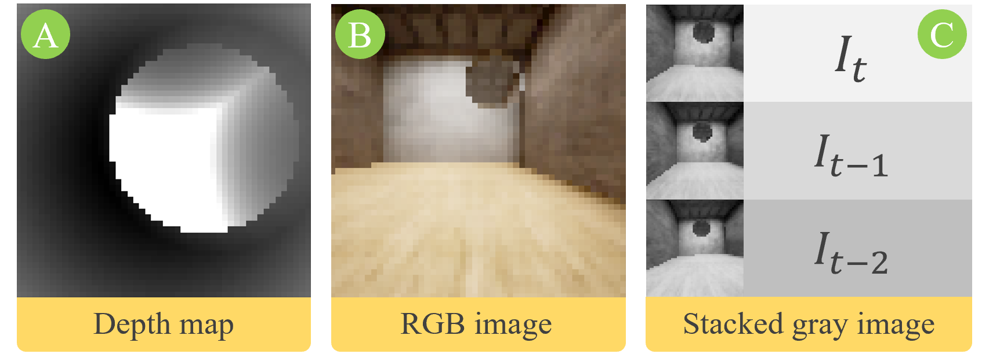
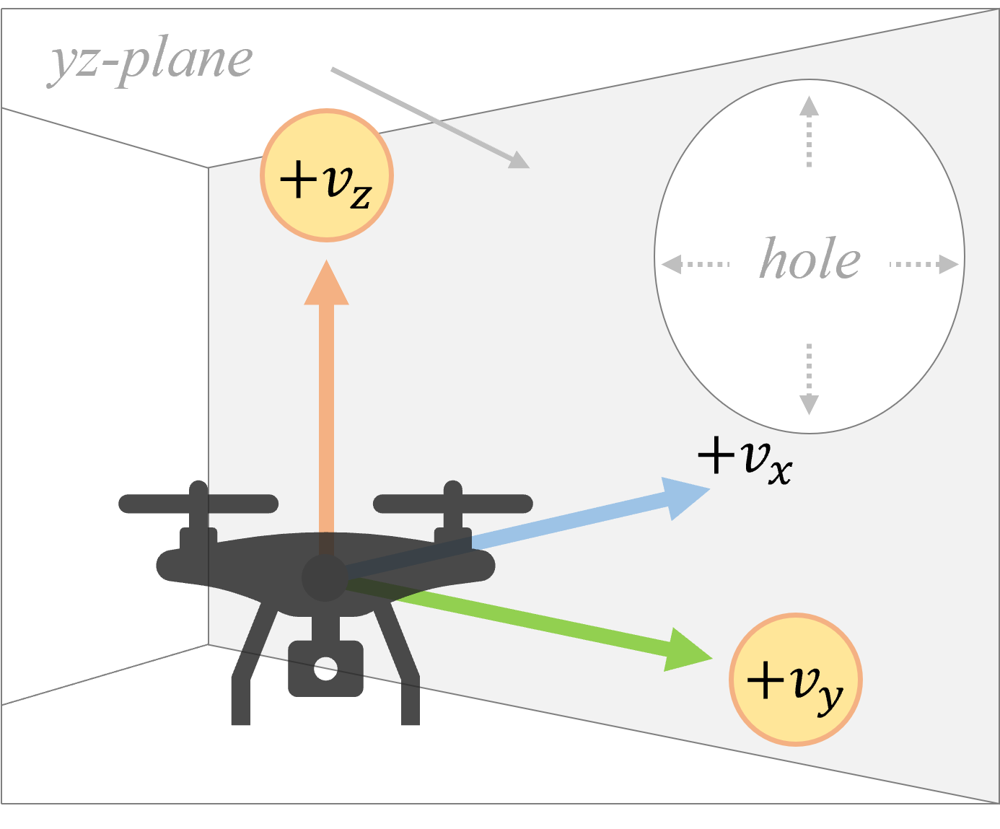
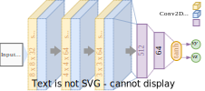
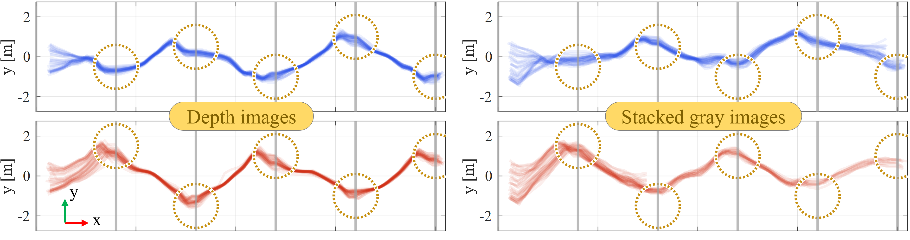

# DRL-Nav: Autonomous UAV Navigation via Deep Reinforcement Learning Using PPO
[](LICENSE)

> ℹ️ This work is an extension of [my previous work](https://github.com/bilalkabas/PPO-based-Autonomous-Navigation-for-Quadcopters): "PPO-based Autonomous Navigation for Quadcopters". In this work, actions are continuous and the agent is trained using different input types. Tests are performed both randomly and sequentially.

> ⚠ This document is best viewed in [light theme](https://docs.github.com/en/account-and-profile/setting-up-and-managing-your-github-user-account/managing-user-account-settings/managing-your-theme-settings).

This repository contains an implementation of Proximal Policy Optimization (PPO) for autonomous navigation in a corridor environment with a quadcopter. There are blocks having circular opening for the drone to go through for each 4 meters. The goal is that the agent navigates through these openings without colliding with blocks. The train and test environments were created using Unreal Engine and Microsoft AirSim. **This project currently runs only on Windows since Unreal environments were packaged for Windows.**

## Contents

  - [Overview](#overview)
    - [Inputs](#inputs)
    - [Actions](#actions)
    - [Neural Network](#neural-network)
  - [Results](#results)
    - [Random tests](#random-tests)
    - [Sequential Tests](#sequential-tests)
  - [Environment setup to run the codes](#environment-setup-to-run-the-codes)
  - [How to run the training?](#how-to-run-the-training)
  - [How to run the pretrained model?](#how-to-run-the-pretrained-model)

## Overview

The training environment has 15 sections with different textures and hole positions. The agent starts at these sections randomly. The starting point of the agent is also random within a specific region in the yz-plane.

### Inputs
There are three models trained using depth, single RGB, and stacked gray images, respectively. Their sizes are as follows

- **Depth map:** 50 x 50 x 1
- **Single RGB image:** 50 x 50 x 3
- **Depth image:** 50 x 150 x 1

<p align="left">
  
</p>

### Actions
There are two actions:


<p align="left">
  
</p>

### Neural Network
In this work, a five layer neural network is used.

<p align="left">
  
</p> <br>

## Results

The test environment has different textures and hole positions than that of the training environment.

### Random tests
Average success rate (%) in random tests for each models trained using three different input types:

| Input type  | Train | Test |
| -                 | -         | -         |
| Depth             | %100      | %99.5     |
| Single RGB        | %98.5     | %92       |
| Stacked gray      | %98.5     | %96       |
| Random actions    | %11       | %22.5     |

### Sequential Tests

Trajectories of the agent trained using depth and stacked gray images (medium and difficult test environments are indicated by blue and red, respectively):

<p align="left">
  
</p>

## Environment setup to run the codes
#️⃣ **1. Clone the repository**

```
git clone https://github.com/bilalkabas/DRL-Nav
```

#️⃣ **2. From Anaconda command prompt, create a new conda environment**

I recommend you to use [Anaconda or Miniconda](https://www.anaconda.com/products/individual-d) to create a virtual environment.

```
conda create -n drl_nav python==3.8
```

#️⃣ 3. **Install required libraries**

Inside the main directory of the repo

```
conda activate drl_nav
pip install -r requirements.txt
```

#️⃣ 4. **(Optional) Install Pytorch for GPU**

> You must have a CUDA supported NVIDIA GPU.


<details>
<summary>Details for installation</summary>

<!-- - [Install CUDA](https://docs.nvidia.com/cuda/cuda-installation-guide-microsoft-windows/index.html) -->
- [Install Pytorch with the compatible CUDA version](https://pytorch.org/get-started/locally/)

For this project, I used CUDA 11.0 and the following conda installation command to install Pytorch:

```
conda install pytorch==1.7.1 torchvision==0.8.2 torchaudio==0.7.2 cudatoolkit=11.0 -c pytorch
```

</details>

#️⃣ **4. Edit `settings.json`**

Content of the settings.json should be as below:

> The `setting.json` file is located at `Documents\AirSim` folder.

```json
{
    "SettingsVersion": 1.2,
    "LocalHostIp": "127.0.0.1",
    "SimMode": "Multirotor",
    "ClockSpeed": 40,
    "ViewMode": "SpringArmChase",
    "Vehicles": {
        "drone0": {
            "VehicleType": "SimpleFlight",
            "X": 0.0,
            "Y": 0.0,
            "Z": 0.0,
            "Yaw": 0.0
        }
    },
    "CameraDefaults": {
        "CaptureSettings": [
            {
                "ImageType": 0,
                "Width": 50,
                "Height": 50,
                "FOV_Degrees": 120
            },
            {
                "ImageType": 2,
                "Width": 50,
                "Height": 50,
                "FOV_Degrees": 120
            }
        ]
    }
}
```

## How to run the training?
Make sure you followed the instructions above to setup the environment.

#️⃣ **1. Download the training environment**

Go to the [releases](https://github.com/bilalkabas/DRL-Nav/releases) and download `TrainEnv.zip`. After downloading completed, extract it.

#️⃣ **2. You can change the training mode to produce model outputs for different input types**

In the main project directory, go to [`config.yml`](/config.yml). Here you can change the training mode to `depth`, `single_rgb`, or `multi_rgb`.

#️⃣ **3. Now, you can open up environment's executable file and start the training**

So, inside the repository
```
python train.py
```

## How to run the pretrained model?
Make sure you followed the instructions above to setup the environment. To speed up the training, the simulation runs at 20x speed. You may consider to change the `"ClockSpeed"` parameter in `settings.json` to 1.

#️⃣ **1. Download the test environment**

Go to the [releases](https://github.com/bilalkabas/DRL-Nav/releases) and download `TestEnv.zip`. After downloading completed, extract it.

#️⃣ **2. Change the test mode**

In [`config.yml`](/config.yml), you can change the test mode to `depth`, `single_rgb`, or `multi_rgb`. This should match the input type that the model was trained with. In the same config file, you can change the test type to `sequential` or `random`.

#️⃣ **3. Now, you can open up environment's executable file and run the trained model**

So, inside the repository
```
python inference.py
```

## Citation

```
@INPROCEEDINGS{9864769,  
author={Kabas, Bilal},  
booktitle={2022 30th Signal Processing and Communications Applications Conference (SIU)},   
title={Autonomous UAV Navigation via Deep Reinforcement Learning Using PPO},   
year={2022},  
pages={1-4},  
doi={10.1109/SIU55565.2022.9864769}}
```

## Author

- [Bilal Kabas](https://github.com/bilalkabas)

## License

This project is licensed under the [GNU Affero General Public License](LICENSE).
